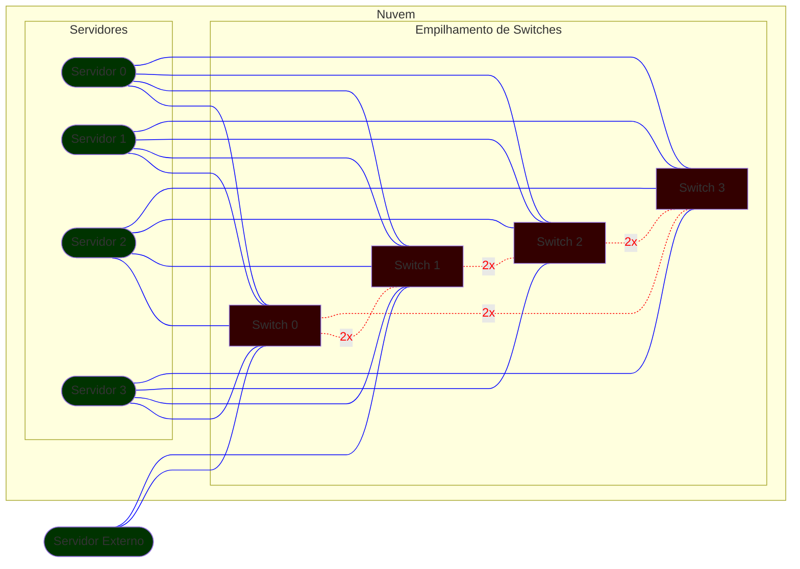

# IFMT-K8s

## Desenho da rede

```mermaid
%%{ init: { 'flowchart': { 'curve': 'bumpX' } } }%%
flowchart LR
  classDef switch fill:#330000
  classDef servidor fill:#003300

  Server([Servidor Externo])

  subgraph Nuvem
    subgraph Empilhamento de Switches
      Switch0[Switch 0]
      Switch1[Switch 1]
      Switch2[Switch 2]
      Switch3[Switch 3]
    end

    subgraph Servidores
      Server0([Servidor 0])
      Server1([Servidor 1])
      Server2([Servidor 2])
      Server3([Servidor 3])
    end

    Switch0 -.- |2x| Switch1
    Switch1 -.- |2x| Switch2
    Switch2 -.- |2x| Switch3
    Switch3 -.- |2x| Switch0

    Server0 --- Switch0
    Server0 --- Switch1
    Server0 --- Switch2
    Server0 --- Switch3

    Server1 --- Switch0
    Server1 --- Switch1
    Server1 --- Switch2
    Server1 --- Switch3

    Server2 --- Switch0
    Server2 --- Switch1
    Server2 --- Switch2
    Server2 --- Switch3

    Server3 --- Switch0
    Server3 --- Switch1
    Server3 --- Switch2
    Server3 --- Switch3
  end

  Server --- Switch0
  Server --- Switch1

  class Switch0,Switch1,Switch2,Switch3 switch
  class Server,Server0,Server1,Server2,Server3 servidor
  linkStyle 0,1,2,3 stroke:#ff0000,color:#ff0000
  linkStyle 4,5,6,7,8,9,10,11,12,13,14,15,16,17,18,19,20,21 stroke:#0000ff
```
